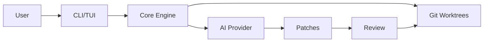

# CCI - Claude Code IDE

Welcome to **CCI**, a git worktree-first IDE with prompt-driven patch workflow, developed entirely by AI.

<div class="grid cards" markdown>

-   :material-rocket-launch:{ .lg .middle } **Quick Start**

    ---

    Get up and running with CCI in minutes

    [:octicons-arrow-right-24: Getting started](getting-started/quickstart.md)

-   :material-book-open:{ .lg .middle } **User Guide**

    ---

    Learn how to use CCI effectively

    [:octicons-arrow-right-24: User guide](user-guide/overview.md)

-   :material-code-braces:{ .lg .middle } **API Reference**

    ---

    Detailed API documentation

    [:octicons-arrow-right-24: Reference](api/cli.md)

-   :material-robot:{ .lg .middle } **AI Development**

    ---

    How CCI is built by AI

    [:octicons-arrow-right-24: AI Development](contributing/ai-development.md)

</div>

## Features

### ✅ Implemented

- **Project Management** - Create, open, and manage multiple projects
- **Welcome Screen** - Beautiful TUI dashboard for project navigation
- **CLI Commands** - Full-featured command-line interface
- **Project Registry** - Persistent storage of project metadata
- **Pydantic Models** - Type-safe data validation
- **Test Suite** - Comprehensive testing with pytest

### 🚧 In Progress

- **Git Worktrees** - Manage multiple worktrees per project
- **Prompt System** - AI-driven development workflow
- **Patch Review** - Review and apply patches interactively
- **Settings Management** - Configure CCI to your preferences

### 📋 Planned

- **AI Integration** - Multiple AI provider support
- **Templates** - Project and prompt templates
- **Collaboration** - Team features
- **Extensions** - Plugin system

## Why CCI?

CCI reimagines the development workflow by putting AI at the center:

1. **Worktree-First**: Every feature gets its own isolated worktree
2. **Prompt-Driven**: Describe what you want, AI generates the code
3. **Patch Review**: Review changes before applying
4. **No Merge Conflicts**: AI doesn't create conflicts with itself
5. **Full Transparency**: See exactly what AI is doing

## Quick Example

```bash
# Create a new project
cci new ~/my-project --name "My Project"

# Open the welcome screen
cci

# Work with prompts (coming soon)
cci prompt "Add user authentication with JWT"
cci patch review
cci patch apply
```

## Architecture



## Development Status

CCI is under active development by Claude Code. Check our [development status](development/status.md) for the latest updates.

!!! info "AI-First Development"
    This entire project is developed by Claude Code. Humans provide requirements and conduct UAT, but all code is written by AI.

## Getting Help

- Check the [User Guide](user-guide/overview.md) for detailed usage instructions
- See [Testing Guide](development/testing.md) for running tests
- View [API Reference](api/cli.md) for technical details
- Read [Contributing Guidelines](contributing/guidelines.md) to get involved

## License

CCI is open source software licensed under the MIT License.