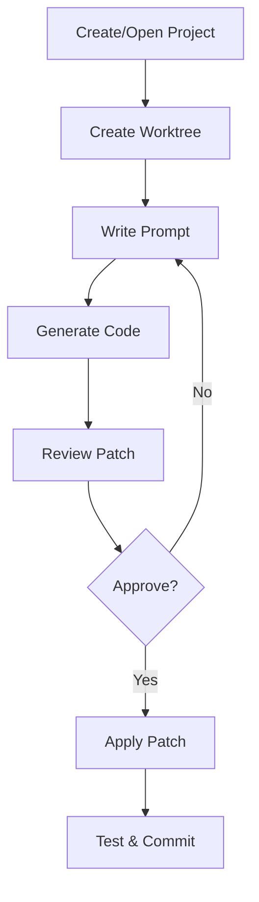

# User Guide Overview

Welcome to the CCI User Guide! This guide will help you understand and use all features of CCI effectively.

## What is CCI?

CCI (Claude Code IDE) is a revolutionary development environment that:

- **Manages projects** with an intuitive interface
- **Uses git worktrees** for isolated development
- **Integrates AI** for code generation
- **Reviews patches** before applying changes

## Core Concepts

### Projects
Every codebase you work with is a "project" in CCI. Projects are registered and tracked, making it easy to switch between them.

### Worktrees
Git worktrees allow you to have multiple working directories for the same repository. CCI makes worktree management seamless.

### Prompts
Describe what you want to build in natural language, and CCI will generate the code for you.

### Patches
All changes are presented as patches that you can review, modify, and selectively apply.

## Workflow



## User Interface

CCI provides two interfaces:

### CLI (Command Line Interface)
Perfect for quick operations and scripting:
```bash
cci new ~/project
cci list
cci open
```

### TUI (Terminal User Interface)
Beautiful interface for interactive work:
- Visual project browser
- Keyboard navigation
- Rich formatting

## Getting Started

1. [Install CCI](../getting-started/installation.md)
2. [Create your first project](projects.md)
3. [Learn the workflow](../getting-started/quickstart.md)

## Topics

- [Project Management](projects.md) - Create and manage projects
- [Worktree Operations](worktrees.md) - Work with git worktrees
- [Prompt System](prompts.md) - Generate code with AI
- [Patch Review](patches.md) - Review and apply changes

## Best Practices

1. **One worktree per feature** - Keep changes isolated
2. **Clear prompts** - Be specific about what you want
3. **Review carefully** - Always review generated code
4. **Test thoroughly** - Run tests before committing
5. **Document changes** - Keep good commit messages

## Getting Help

- Press `?` in the TUI for help
- Use `--help` flag with any CLI command
- Check the [API Reference](../api/cli.md) for details